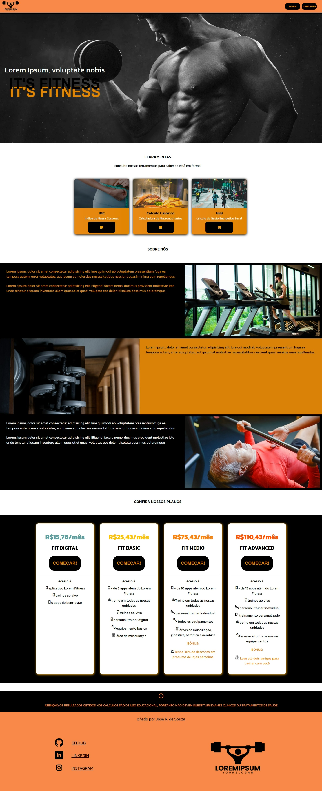

# Projeto Site Lorem Ipsum Fitness
 Este é um projeto de um site de uma academia fictícia que oferece três ferramentas de cálculo, além de duas páginas de cadastro e Login. É meu segundo projeto original.

 ## Linguagens

 <ul>
    <li>HTML5</li>
    <li>CSS3</li>
    <li>JavaScript</li>
 </ul>

 ## Funcionalidades

<ul>
 <li>Calculadora de IMC (Índice de Massa Corporal);</li>
 <li>Calculadora de Calorias;</li>
 <li>Calculadora de GEB (Gasto Energético Basal);</li>
 <li>Responsividade;</li>
 </ul>

 ### links externos

 Veja e teste meu projeto com seus própios olhos:
  
 Meu Linkedin: 

 ## Visão geral da página Home

 </img>

 ## demonstrações

teste readme

 <!-- ## Demonstrações

 Na imagem acima, vemos que o usuário inseriu sua altura como 1,52 e seu peso como 61,2 -->

   <!-- Este projeto é um site de uma academia fictícia que oferece três ferramentas de cálculo que desenvolvi usando JavaScript, sendo elas para obtenção de IMC (Índice de Massa Corporal), valor calórico e de GEB (Gasto Energético Basal). Neste projeto, inseri logo tudo que aprendi com JavaScript usando a API do Via Cep e o conceito de Mobile First. -->
